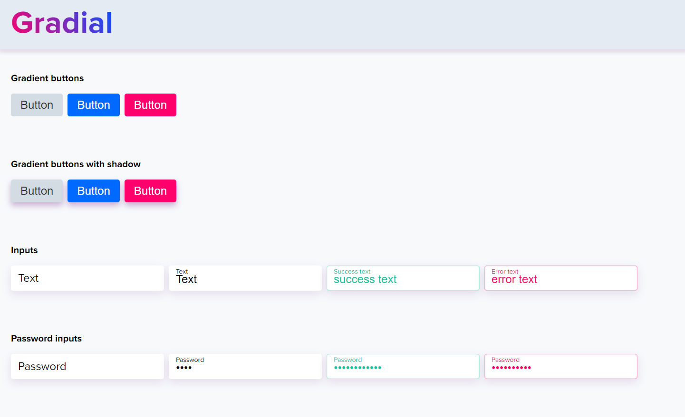

# Gradial
Library of ui elements

Gradial has ui solutions of:
 - Buttons
 - Inputs
 - paragraphs
 - lists
 - links

 ## How to use or add new solutions
- `git clone`
- `npm start` - for start gulp task runner
- `npm run clean` - for clean build folder

## How to use in your project
- in head of your html file add link to css file `gradial.css ` or `gradial.min.css`

## Why?
 I'm front-end developer, and i want create my solutions for simple work with ui.
